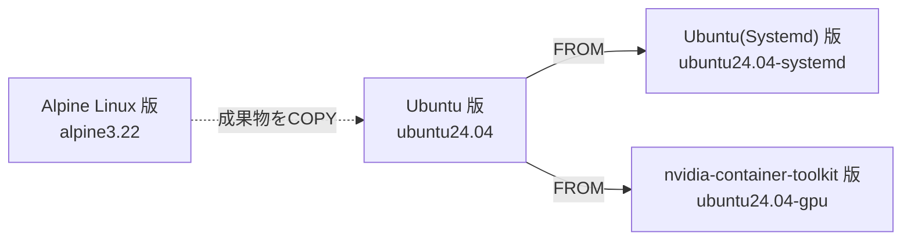

# コンテナイメージ一覧 { #container-images }

各コンテナイメージの詳細について記載する。  
共通機能については、[共通機能](index.md#common-features)参照。

コンテナイメージは、`harbor.vcloud.nii.ac.jp/vcp/base` リポジトリで公開されている。  

!!! note 利用可能なコンテナイメージ一覧取得

    Harbor API（v2.0）を用いて、利用可能なベースコンテナイメージのタグの一覧を取得することができる。  

    ```
    curl -s https://harbor.vcloud.nii.ac.jp/api/v2.0/projects/vcp/repositories/base/artifacts?q=tags=* | jq .[].tags[0].name
    ```

## イメージの継承関係 { #image-hierarchy }

各コンテナイメージの関係は以下の通り。  
Ubuntu(Systemd) 版・nvidia-container-toolkit 版は、Ubuntu 版イメージを `FROM` で指定して構築されている。  
Ubuntu 版は Alpine Linux 版から直接派生したイメージではなく、Alpine Linux 版イメージ内で構築した成果物（`uv`、cAdvisor/Serfのバイナリ、各種設定ファイルなど）を `COPY --from` でコピーして利用している。



## Alpine Linux 版 { #alpine-linux }

### リリース一覧 { #alpine-linux-releases }

| タグ | リリース日 | 備考 |
|------|------|--|
|3.0.0-alpine3.22|2026-10-01|vcpで起動するデフォルトのイメージ|

## Ubuntu 版 { #ubuntu }

### リリース一覧 { #ubuntu-releases }

| タグ | リリース日 | 備考 |
|------|------|--|
|3.0.0-ubuntu24.04|2026-10-01||

## Ubuntu(Systemd) 版 { #ubuntu-systemd }

### 機能 { #ubuntu-systemd-features }

- [Ubuntu 版](#ubuntu) を継承したイメージで、各サービス（sshd、cAdvisor、Serfなど）をSystemdのサービスユニットとして管理するよう変更したイメージ

### リリース一覧 { #ubuntu-systemd-releases }

| タグ | リリース日 | 備考 |
|------|------|--|
|3.0.0-ubuntu24.04-systemd|2026-10-01||

## nvidia-container-toolkit 版 { #nvidia-container-toolkit }

### 機能 { #nvidia-container-toolkit-features }

- [nvidia-container-toolkit](https://docs.nvidia.com/datacenter/cloud-native/container-toolkit/latest/index.html) をインストール済みで、GPU搭載環境での利用を前提としている
- [DCGM-Exporter](https://github.com/NVIDIA/dcgm-exporter) が常時稼働しており、VCコントローラ上の [Prometheus](https://prometheus.io/) により、GPUのメトリクス情報を収集する

### リリース一覧 { #nvidia-container-toolkit-releases }

| タグ | リリース日 | 備考 |
|------|------|--|
|3.0.0-ubuntu24.04-gpu|2026-10-01||


# 補足 { #supplement }

## タグの命名規則 { #tag-naming-convention }

コンテナイメージのタグは、以下の命名規則に従う。

```
{ベースコンテナのバージョン}-{OSディストリビューション名、バージョン番号}[-systemd][-gpu][-{リリース番号}]
```

| 項目 | 説明 | 例 | 備考 |
|------|-----|--|--|
|ベースコンテナのバージョン|ベースコンテナのバージョンを指定|`3.0.0`| |
|OSディストリビューション名、バージョン番号|ベースコンテナのOSディストリビューション名とバージョン番号を指定|`alpine3.22`| |
|Systemd管理サポート有無|各サービスをSystemdのサービスユニットで管理する場合は `-systemd` を指定|`-systemd`| [Ubuntu(Systemd) 版](#ubuntu-systemd)のみ |
|GPUサポート有無|GPUサポートがある場合は `-gpu` を指定|`-gpu`| |
|リリース番号|同一バージョンのベースコンテナを複数回リリースする場合に、リリースの順番を識別するための番号を指定|`-1`| リリース候補の場合は `-rc{n}` を指定 |
