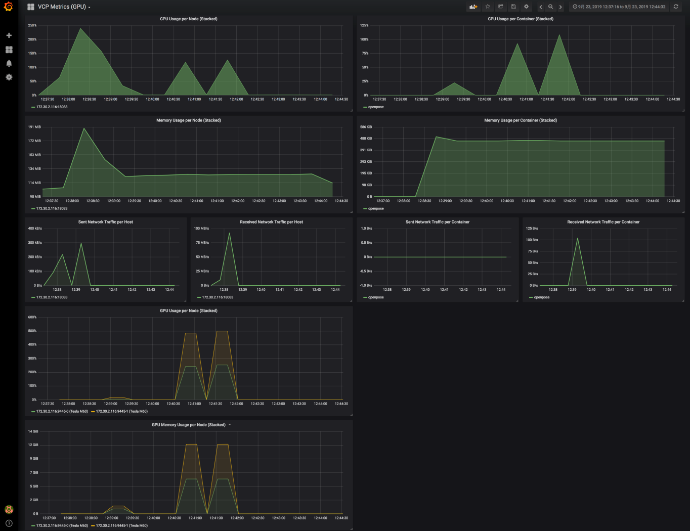

# 運用ガイド

構築した VCP 環境を継続して運用するための情報です。VC 管理者を対象としています。

構築そのものについては[はじめる](../getting-started/setup.md)を参照してください。

---

## 管理操作

VC コントローラの停止・起動・破棄、ユーザの管理、VCP REST API アクセストークンの発行、VPN カタログの
更新、ログの確認については、[管理操作](../vcc/manipulation.md)にまとめられています。

---

## 構成の確認

VC コントローラは複数のコンテナで構成されています。REST API を提供する occtr、クラウドプロバイダの
認証情報を管理する OpenBao、各ノードの死活監視を行う serf、メトリクスを収集する Prometheus、
コンテナレジストリ、利用者アクセスの入口となる Nginx などです。

各コンテナの役割と公開ポート番号は[インストール](../vcc/installation.md)の「サービス一覧」に
一覧されています。障害の切り分けやファイアウォールの設定を行う際に参照してください。

---

## リソースの監視

VC コントローラには Prometheus と Grafana が組み込まれており、VC ノードのリソース使用状況を
確認できます。アクセス方法と初期アカウントは
[Grafana](../vcc/installation.md#grafana)を参照してください。

### VCP Metrics ダッシュボード

Grafana には **VCP Metrics** というダッシュボードが用意されています。GPU を利用する環境では
GPU 用のダッシュボードもあわせて参照できます。

表示される主な項目は次のとおりです。いずれも**ノード単位とコンテナ単位の両方**で確認できます。

| 項目 | 内容 |
|---|---|
| CPU Usage | CPU 使用率 |
| Memory Usage | メモリ使用量 |
| Sent / Received Network Traffic | 送受信のネットワーク流量 |
| GPU Usage | GPU 使用率 (GPU 環境のみ) |
| GPU Memory Usage | GPU メモリ使用量 (GPU 環境のみ) |

ノード単位の値とコンテナ単位の値を見比べることで、負荷がどの層で発生しているかを切り分けられます。
たとえばノード全体の CPU 使用率が高いのに特定のコンテナの使用率が低い場合、別のコンテナや
ベースコンテナ側の処理が負荷の原因である可能性があります。

> **注意**
>
> 上の画面例は取得時期が古く、実際の画面は Grafana のバージョンによって異なります。パネルの
> 構成や項目名は同様ですが、配色や操作方法は表示されているものと違う場合があります。

### テンプレート固有の可視化

アプリケーションテンプレートで構築した環境では、テンプレート固有の可視化用 Notebook が用意されて
いる場合があります。CoursewareHub では single-user サーバコンテナの起動数やリソース使用量を
確認できます。詳細は各テンプレートの Notebook を参照してください。

---

## 証明書

VC コントローラは Jupyter 環境との通信に HTTPS を使用するため、SSL 証明書が必要です。初期構築時の
配置方法は[SSL証明書](../vcc/installation.md#ssl)を参照してください。

---

## 準備中の項目

以下の項目は現在ドキュメントを整備中です。対応が必要な場合は
[お問い合わせ](../support/README.md#お問い合わせ)ください。

- VC コントローラのアップデート
- バックアップとリストア
- 証明書の更新
- コンテナレジストリの運用
- 秘密情報管理サーバ (OpenBao) の運用

---

## 関連

- [管理操作](../vcc/manipulation.md) — VC コントローラの操作
- [インストール](../vcc/installation.md) — 要件、ネットワーク要件、サービス一覧
- [FAQ・サポートポリシー](../support/README.md) — 問題が起きた場合
- [用語集](../glossary.md) — 用語の定義
