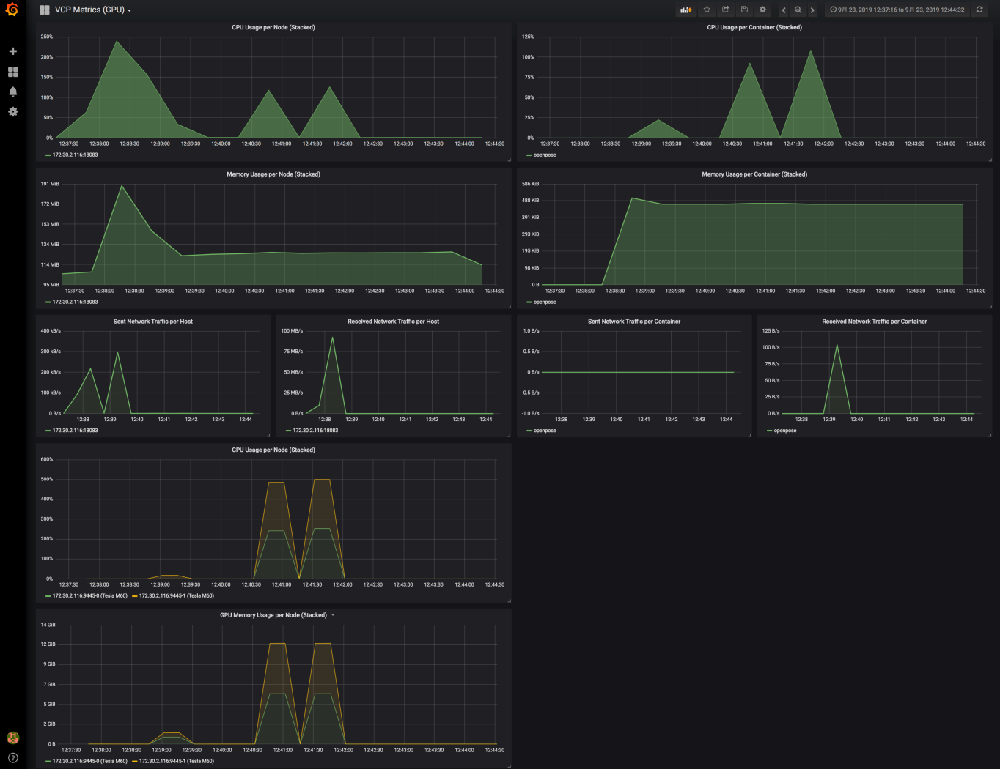

# 運用ガイド

構築した VCP 環境を継続して運用するための情報です。VC 管理者を対象としています。

構築そのものについては[はじめる](../getting-started/setup.md)を参照してください。

---

## 管理操作

VC コントローラの停止・起動・破棄、イメージの更新、証明書の更新、ユーザの管理、アクセストークンの発行、
VPN カタログの更新、ログの確認、バックアップとリストアについては、ポータブル版の
[管理操作](https://github.com/nii-gakunin-cloud/ocs-vcp-portable/blob/feature/vcc2610-volume/docs/manipulation.md)にまとめられています。

---

## 構成の確認

VC コントローラは複数のコンテナで構成されています。REST API を提供する occtr、クラウドプロバイダの
認証情報を管理する OpenBao、各ノードの死活監視を行う serf、メトリクスを収集する Prometheus、
コンテナレジストリ、利用者アクセスの入口となる Nginx などです。

各コンテナの役割と公開ポート番号は、ポータブル版の[インストール手順](https://github.com/nii-gakunin-cloud/ocs-vcp-portable/blob/feature/vcc2610-volume/docs/installation.md)の「サービス一覧」に
一覧されています。VC コントローラと VC ノードの間で必要な通信は、同じページの「ネットワーク要件」に
あります。障害の切り分けやファイアウォールの設定を行う際に参照してください。

---

## リソースの監視

VC コントローラには Prometheus と Grafana が組み込まれており、VC ノードのリソース使用状況を
確認できます。アクセス方法と初期アカウントは、ポータブル版の
[Grafana](https://github.com/nii-gakunin-cloud/ocs-vcp-portable/blob/feature/vcc2610-volume/docs/services/grafana.md)を参照してください。

### VCP Metrics ダッシュボード

Grafana には **VCP Metrics** というダッシュボードが用意されています。GPU を利用する環境では
GPU 用のダッシュボードもあわせて参照できます。

表示される主な項目は次のとおりです。いずれも**ノード単位とコンテナ単位の両方**で確認できます。

| 項目 | 内容 |
|---|---|
| CPU Usage | CPU 使用率 |
| Memory Usage | メモリ使用量 |
| Sent / Received Network Traffic | 送受信のネットワーク流量 |
| GPU Usage | GPU 使用率 (GPU 環境のみ) |
| GPU Memory Usage | GPU メモリ使用量 (GPU 環境のみ) |

ノード単位の値とコンテナ単位の値を見比べることで、負荷がどの層で発生しているかを切り分けられます。
たとえばノード全体の CPU 使用率が高いのに特定のコンテナの使用率が低い場合、別のコンテナや
ベースコンテナ側の処理が負荷の原因である可能性があります。

> **注意**
>
> 上の画面例は取得時期が古く、実際の画面は Grafana のバージョンによって異なります。パネルの
> 構成や項目名は同様ですが、配色や操作方法は表示されているものと違う場合があります。

### テンプレート固有の可視化

アプリケーションテンプレートで構築した環境では、テンプレート固有の可視化用 Notebook が用意されて
いる場合があります。CoursewareHub では single-user サーバコンテナの起動数やリソース使用量を
確認できます。詳細は各テンプレートの Notebook を参照してください。

---

## 証明書

VC コントローラは、用途の異なる 2 種類の証明書を使います。

- **内部通信用の証明書** — Notebook 環境、VC コントローラ、秘密情報管理サーバの間の HTTPS 通信に使います。
  初期セットアップで自己署名の証明書が自動的に作成されます。
- **Nginx 用の証明書** — Nginx で TLS 終端を行う場合に使います。利用者のブラウザから検証されるため、
  正規のサーバ証明書が必要です。標準の構成では使いません。

TLS の設定方法はポータブル版の[インストール手順](https://github.com/nii-gakunin-cloud/ocs-vcp-portable/blob/feature/vcc2610-volume/docs/installation.md)の「TLS設定」を、証明書の更新方法は
[管理操作](https://github.com/nii-gakunin-cloud/ocs-vcp-portable/blob/feature/vcc2610-volume/docs/manipulation.md)の「TLS証明書の更新」を参照してください。

---

## アップデートとバックアップ

以下の作業は、ポータブル版のドキュメントにまとめられています。

| 作業 | 参照先 |
|---|---|
| VC コントローラのアップデート | [管理操作](https://github.com/nii-gakunin-cloud/ocs-vcp-portable/blob/feature/vcc2610-volume/docs/manipulation.md)の「VCコントローラのイメージバージョン更新」 |
| バックアップとリストア | [管理操作](https://github.com/nii-gakunin-cloud/ocs-vcp-portable/blob/feature/vcc2610-volume/docs/manipulation.md)の「バックアップ & リストア」 |
| コンテナレジストリの運用 | [Registry](https://github.com/nii-gakunin-cloud/ocs-vcp-portable/blob/feature/vcc2610-volume/docs/services/registry.md) |

---

## 準備中の項目

以下の項目は現在ドキュメントを整備中です。対応が必要な場合は
[お問い合わせ](../support/README.md#お問い合わせ)ください。

- 秘密情報管理サーバ (OpenBao) の運用

---

## 関連

- [管理操作](https://github.com/nii-gakunin-cloud/ocs-vcp-portable/blob/feature/vcc2610-volume/docs/manipulation.md) — VC コントローラの操作 (ポータブル版)
- [インストール手順](https://github.com/nii-gakunin-cloud/ocs-vcp-portable/blob/feature/vcc2610-volume/docs/installation.md) — 要件、ネットワーク要件、サービス一覧 (ポータブル版)
- [FAQ・サポートポリシー](../support/README.md) — 問題が起きた場合
- [用語集](../glossary.md) — 用語の定義
