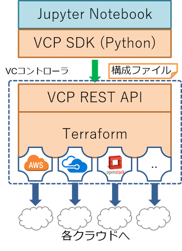

# 概要

**VCP SDK** (`vcpsdk`) は、[VCP (Virtual Cloud Provider)](https://github.com/nii-gakunin-cloud/ocs-vcp-portable) の
VCコントローラ (VCC) が提供する REST API を Python から利用するためのクライアントライブラリである。
主に JupyterNotebook 上から利用することを想定しており、AWS・Azure・GCP・Oracle Cloud・さくらのクラウド・
VMware・Proxmox VE・MDX2・既存サーバ(onpremises) など複数の実クラウド環境を横断して、仮想クラスタ(VC)・
Unit・Node・Disk の作成/操作を統一的な API で行うことができる。

VCP SDK 自体はクラウドリソースを直接操作せず、VCコントローラの REST API を呼び出すことで VC/Unit/Node の
作成・削除・状態確認を行う。実際のクラウドリソースの起動・削除は、VCコントローラ側で Terraform (OpenTofu) が
実行することで行われる。

## 高レベルAPIと低レベルAPI

VCP SDK は2階層のAPIで構成される。

| モジュール | 位置づけ | 説明 |
|---|---|---|
| `vcpsdk` | 高レベルAPI | `VcpSDK` を起点に VC(UnitGroup)/Unit/Node/Disk を操作する。通常はこちらを利用する。 |
| `vcplib` | 低レベルAPI | VCC REST API を直接ラップしたクライアント(`Occtr` など)。`vcpsdk` の内部実装で使われているが、直接呼び出すことも可能。 |

## 主なクラス (`vcpsdk`)

| クラス | 役割 |
|---|---|
| `VcpSDK` | SDK のエントリポイント。アクセストークンと設定ディレクトリから初期化し、UnitGroup(VC)の作成・検索や spec/extension の取得を行う。 |
| `VcpUnitGroupClass` | UnitGroup(VC)1個に対応するオブジェクト。`create_unit()` によるUnit作成や、Unit/Nodeの一覧取得、VCの削除(cleanup)などを行う。 |
| `VcpUnitClass` | Unit1個に対応するオブジェクト。`add_nodes()`/`delete_nodes()` によるNode操作や、Node起動/停止・状態監視(watch)を行う。 |
| `VcpSpecClass` / `VcpSpecResource` | Unit/Node作成時に指定するクラウドプロバイダ固有のスペック(インスタンスタイプ、ディスクサイズ、タグなど)を表す。`VcpSDK.get_spec()` で取得する。 |

詳細は [APIリファレンス](api/vcpsdk.md) を参照。

## 対応クラウドプロバイダ

* AWS (オンデマンドインスタンス)
* AWS (EC2 Spot Instance)
* Microsoft Azure
* Google Cloud Platform
* Oracle Cloud Infrastructure
* さくらのクラウド
* VMware vSphere
* MDX2
* Proxmox VE
* 既存サーバ (onpremises)
    - Dockerインストール済みの sshログイン可能なLinuxマシンを「既存サーバ」として使用する
    - VCPでは既存サーバを `onpremises` というクラウドプロバイダとみなす

プロバイダごとに指定可能なパラメータは `vcpsdk.plugins` 配下の実装(例: `vcpsdk.plugins.aws.VcpSpecResourceAws`)の
docstring、および `vcp_flavor.yml` (後述) を参照すること。

## ドキュメント構成

* [インストール](installation.md) — VCP SDK のインストールと設定ファイルの準備
* [クイックスタート](quickstart.md) — VC(UnitGroup)/Unit/Node 作成の最小手順
* APIリファレンス
    * [vcpsdk (高レベルAPI)](api/vcpsdk.md)
    * [vcplib (低レベルAPI)](api/vcplib.md)
