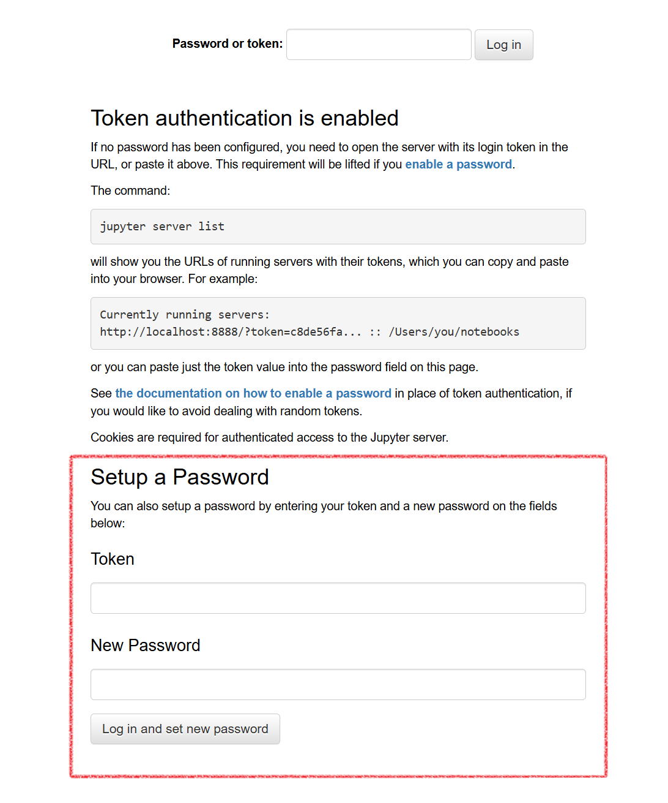

# クイックスタート

VCPで提供しているコンテナイメージの利用方法について説明する。  

## 前提条件

- Dockerがインストール済みであること

## 起動

1. **Jupyter Notebookコンテナイメージを起動する**  

    以下コマンドを実行すると、ポート=8888番, ベースURL=`/jupyter` でJupyter Notebookコンテナが起動する。  

    ```
    docker run -d -p 8888:8888 \
        --name vcp-jupyter-8888 \
        -u root \
        -e TZ=JST-9 \
        -e CHOWN_HOME=yes \
        -e CHOWN_HOME_OPTS=-R \
        --restart=always harbor.vcloud.nii.ac.jp/vcpjupyter/cloudop-notebook:lab-4.5.7-simple \
        start-notebook.py --ServerApp.base_url=/jupyter
    ```

1. **初回アクセス用のトークンを確認する**

    ```
    docker logs vcp-jupyter-8888 | grep token
    ```

1. **ブラウザから `http://localhost:8888/jupyter` にアクセスし、トークンを用いてログインする**

    画面の指示に従い、トークンの入力と、任意のパスワードの設定を行う。以降は、設定したパスワードを用いてログインする。

    