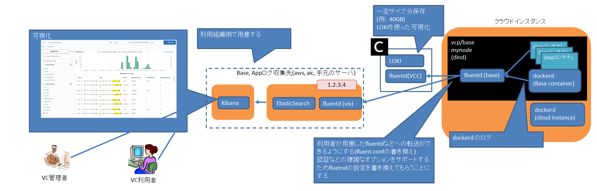

# 付録

## 用語

| 用語                           | 説明                                                                                                                   |
| ---------------------------- | -------------------------------------------------------------------------------------------------------------------- |
| 利用機関                         | 本サービスを利用する大学、研究所などの機関。                                                                                               |
| 利用グループ                       | 利用機関内の組織。研究室、研究センター、学部など本サービスの接続申込み単位を指す。                                                                            |
| VC(仮想クラウド)                   | 利用グループ毎に隔離されたクラウド環境。オンプレミスの計算環境からクラウドプロバイダの計算環境まで含む。                                                                 |
| 仮想セグメント                      | クラウドプロバイダ上の利用グループ（後述）専用ネットワークセグメント。AWSでは VPC、Azureでは Vnetと呼ばれる。                                                      |
| VCコントローラ                     | クラウド環境構築・管理のためのソフトウェアコントローラ。VCコントローラと略記する。利用グループ毎に提供される。                                                             |
| 仮想ルータ                        | VC内のネットワークのルーティング行うためのルータ。                                                                                           |
| VC責任者                        | 利用グループならびにVCの責任者。接続申込み責任者。                                                                                           |
| VC管理者                        | VCコントローラの管理者。VCPマネージャを使用して、VCコントローラのアクセストークン（後述）の管理、クラウドアクセスのクレデンシャル（アカウント、シークレットキーなど）の管理などを行う。VC責任者は複数のVC管理者を指定できる。 |
| VC利用者                        | 利用グループのVCコントローラを使用して、クラウド環境を構築する担当者。VC管理者からアクセストークンを入手して作業する。VC管理者は複数のVC利用者にアクセストークンを発行することができる。                     |
| オンデマンド構築サービス運用担当者            | NIIの本サービス運用担当者。VCPマネージャ（後述）を使用して、利用グループが使用するVCコントローラの作成・管理・状態監視・保守などを行う。                                             |
| VCP (Virtual Cloud Provider) | VC利用者は利用者の環境にあるVCP SDKを使用してVCPの機能を呼び出し、仮想クラウド環境の構築・管理を行う。                                                            |
| VCPマネージャ                     | VCコントローラの作成・管理などを行う管理ソフトウェア。NIIの本サービス運用担当者が操作する。                                                                     |

## VCP JupyterNotebook コンテナ仕様

### ベースイメージ

NII（国立情報学研究所）のクラウド運用チームが公開しているJupyter Notebookコンテナ `Jupyter-LC_docker` を使用する。

- GitHub  
  <https://github.com/NII-cloud-operation/Jupyter-LC_docker>
- DockerHub  
  <https://hub.docker.com/r/niicloudoperation/notebook>

Dockerイメージは通常 `latest` タグ指定により取得するが、VCP向けに動作検証を行う必要があるため、VCP JupyterNotebook のバージョンは Jupyter-LC_docker に比較して半年程度の遅れが生じる可能性がある。

### VCP 向けのカスタマイズ

#### 概要

- 独自CSSの適用
  * 配色、フォント等の変更
- 環境変数の設定
  * `PATH=/opt/conda/bin:/notebooks/notebook/vcpsdk/cli:$PATH`
  * `PYTHONPATH=/notebooks/notebook/vcpsdk`
  * `REQUESTS_CA_BUNDLE=/etc/ssl/certs/ca-certificates.crt`
- 各種デーモンプロセスの Supervisor による管理
  * Jupyter kernel
  * crond
- サブディレクトリのURLを利用可能とする
  * e.g.) http://xxx.xxx.xxx.xxx/jupyter/

#### 追加パッケージ

Ubuntu package (APT)

- ldap-utils
- rsync
- tcptraceroute
- cron
- fonts-vlgothic

Conda package

- nbconvert
- jsonschema
- simplejson
- ruamel.yaml

#### VCP Manager CA証明書

JupyterNotebookからVCコントローラ、VaultサーバへのアクセスにSSLを使用するために
VCP Managerが発行したCA証明書を以下のパスに保存する。

- `/etc/ssl/certs/ca-certificates.crt`

### コンテナ起動時に指定する環境変数

以下の環境変数を JupyterNotebookコンテナ起動時に与える必要がある。

- SUBDIR
  
  * JupyterNotebook URL のサブディレクトリ

- PASSWORD
  
  * JupyterNotebook のログインパスワード

- REQUESTS_CA_BUNDLE
  
  * VCP Manager CA証明書のファイルパス

- TZ
  
  * JupyterNotebook コンテナ上の timezone

### JupyterNotebookコンテナ起動方法

環境変数の設定例

- SUBDIR ... jupyter
- TZ ... 東京(+09:00)

```
export key="最新のVCP用JupyterNotebook TAG"
export image_name=vcpjupyter/cloudop-notebook:$key
export name=cloudop-notebook-$key
export passwd="パスワード"

docker run -d -p 8888:8888 \
     --name $name \
     -e REQUESTS_CA_BUNDLE=/etc/ssl/certs/ca-certificates.crt \
     -e PASSWORD=$passwd -e TZ=JST-9 -e SUBDIR=jupyter \
     --restart=always $image_name
```

### JupyterNotebookコンテナのバージョン確認方法

- 環境変数 `VCP_CONTAINER_VERSION` を JupyterNotebook コンテナ内で参照する。
- Docker イメージが `vcpjupyter/cloudop-notebook:20190219-ssl-vcp` 以前の場合、当該環境変数は null 値となる。

### JupyterNotebookログインパスワード変更方法

`/notebooks/notebook/tools/chpasswd.sh` を利用する。

**注意：本scriptを実行すると JupyterNotebook は再起動される**

```
jovyan@519d28789fad:/notebooks/notebook/tools$ bash chpasswd.sh
Enter password: 新しいパスワード
Verify password: 新しいパスワード
[NotebookPasswordApp] Wrote hashed password to /home/jovyan/.jupyter/jupyter_notebook_config.json
```

## VCP Base コンテナ仕様

### Baseコンテナの種類

- Alpine Linux 版
  
  * Docker Official リポジトリの Docker in Docker をベース・イメージとして使用
    * <https://hub.docker.com/_/docker>
  * VCノードのデフォルト・イメージとして利用を推奨
    * 明示的にBaseコンテナイメージを指定しない場合、デフォルトのイメージとして適用される

- Ubuntu 版
  
  * Ubuntu Official リポジトリの LTS (20.04) 版をベース・イメージとして使用
    * <https://hub.docker.com/_/ubuntu>

- CentOS 版
  
  * CentOS Official リポジトリの安定版リリース (7.x) をベース・イメージとして使用
    * <https://hub.docker.com/_/centos>

- nvidia-docker2 版
  
  * Ubuntu Official リポジトリの LTS (20.04) 版をベース・イメージとして使用
  * nvidia-docker2 パッケージをインストール済み
    * <https://nvidia.github.io/nvidia-docker>
  * GPU搭載環境での利用を前提としている

### 共通機能

#### OpenSSH サーバ

* 公開鍵認証を許可する設定で sshd が常時稼働する
* Baseコンテナの環境変数`AUTHORIZED_KEYS` 環境変数により起動時に `root` ユーザの公開鍵を設定可能

#### Docker

* Docker in Docker 構成により Base コンテナ内に Application コンテナを起動可能  
  （Application コンテナを使わない場合は不要）
* Storage Driver として `overlay2` を使用する

#### VCノード監視

* [Hashicorp Serf](https://www.serf.io/) により、VCコントローラ管理下にあるVCノードを死活監視する

#### Dockerコンテナメトリクス収集

* [Google cAdvisor](https://github.com/google/cadvisor) が常時稼働する
* VCコントローラ上の [Prometheus](https://prometheus.io/) により、VCノードのメトリクス情報を収集する
* nvidia-docker2 版Baseコンテナ利用時は、 [NVIDIA GPU Prometheus Exporter](https://github.com/mindprince/nvidia_gpu_prometheus_exporter) が常時稼働する

#### NFSサーバ

Baseコンテナの環境変数 `NFS_AUTOSTART` によりNFSサーバ自動起動の要否を指定可能である。 `vcp/base:1.8.1-*` では NFS v3をサポートする。

NFSの公開ディレクトリ設定は以下のとおり

* 公開するディレクトリ (export directory): `/export`
  
  * CCIのparam_vに Baseコンテナの /export　ディレクトリをクラウドインスタンスのディスク、またはアタッチした外部ディスクをmountするように設定すること
  
  * VCP SDKでの設定例: クラウドインスタンスの /export ディレクトリをBaseコンテナの /export ディレクトリにマウントする

    ```
    spec.param_v = ["/export:/export"]
    ```

* export host (or network): `*`

* host option: `rw,sync,no_subtree_check,fsid=0,no_root_squash`
  
  > root ユーザ (uid=0) からの接続が許可されている点に注意すること

* NFS公開するディレクトリを変更するには /etc/exports ファイルを変更して `exportfs -a` コマンドを実行すること

#### NFSクライアント

##### 使用方法

1. NFSクライアントのBaseコンテナで `rpcbind` コマンドを実行する

2. NFSクライアントのBaseコンテナで mount コマンドでNFSサーバが公開しているディレクトリをマウントする  
   例:

   ```
   mount -t nfs {{NFSサーバのIPアドレス}}:/export /mnt
   ```

* BaseコンテナはNFSクライアントとして外部のNFSサーバの共有ディレクトリをNFSマウントするために必要なパッケージを含む

#### Baseコンテナ起動時のスクリプト実行

Baseコンテナ起動時に、ユーザが指定する任意のスクリプト処理をBase コンテナ上で実行する機能。VC ノードの Power ON API による Base コンテナの再起動時にも同様にスクリプト処理が実行される。

##### 使用方法

* VCP SDK `spec.user_init_command` にユーザが実行したいスクリプト(以下ユーザスクリプト)内容を設定する
  
  設定例:
  
  ```
  spec.user_init_command = """#! /bin/bash
  curl -fsSL "https://harbor.vcloud.nii.ac.jp/harbor/sign-in?redirect_url=%2Fharbor%2Fprojects" > /tmp/harbor.html
  """
  ```

* ユーザスクリプトのデータサイズ上限は93KBとする(Base64エンコード前)。超過した場合はエラーとなる

* ユーザスクリプトには必ずシバンの記述をすること

* ユーザスクリプトは適切なシバンが記述される限りスクリプトの種類(bash、python等)は問わない

* `spec.user_init_command` に設定されたユーザスクリプトはBase64でエンコードされ、`spec`に保持される

##### Baseコンテナ上での動作

* ユーザスクリプトはBaseコンテナ上では `/var/vcp/user_init_command` としてBase64デコードされた状態でファイル化される(ユーザが設定した内容と同一)

* `spec.user_init_command` が設定されていない場合は`/var/vcp/user_init_command`は作成されない

* ユーザスクリプトファイルはBaseコンテナ上で実行権限を付与され実行される

* ユーザスクリプトのBaseコンテナ上での実行ユーザは `root`とする

* ユーザスクリプトのBaseコンテナ上で実行される際のカレントディレクトリは `/` とする

* ユーザスクリプトの実行時のstdoutとstderrorは次のファイルに保存される
  
  ```
  stdout_logfile=/var/log/user_init_command_stdout.log
  stderr_logfile=/var/log/user_init_command_stderr.log
  ```

* ユーザスクリプトはBaseコンテナ起動時に毎回実行される

* ユーザスクリプト実行時にBaseコンテナの他サービスやプロセス(dockerd等)にアクセス可能か否かは保証しない(必要な場合はユーザスクリプト側で対応)

#### その他 インストール済みソフトウェア

- [NVMe management command line interface (nvme-cli)](https://github.com/linux-nvme/nvme-cli)
- [Docker Compose](https://docs.docker.com/compose/)

### 環境変数

以下の環境変数を Base コンテナ起動時に与える必要がある。

#### VC利用者向け

- NFS_AUTOSTART
  
  * NFS サーバを稼働させる場合は `true` を指定
  * NFS サーバを使わない場合は `false` を指定

- AUTHORIZED_KEYS
  
  * Base コンテナの root アカウントに設定するSSH公開鍵を指定
  * **Base64 形式にエンコード** 済みの値を指定すること
  * 複数の公開鍵をまとめて設定することも可能
  * Baseコンテナ起動時にデコードされ、 `/root/.ssh/authorized_keys` に展開される

#### Baseコンテナの開発者向け

以下の項目は、Baseコンテナを開発する上で必要な環境変数である。

- VCCC_ID
  
  * VCコントローラのID (SerfによるVCノード死活監視に使用)

- SERF_NODE_ID
  
  * Serf による VC ノード監視用に使用する VC 内でユニークなID

- VCCCTR_IPADDR
  
  * VCコントローラのサービスネットワーク上のIPアドレス

### Base コンテナの Listening Port とプロセス

Base コンテナは、 host networking モードで起動されるため、
以下の各 Listening Port はBaseコンテナのホスト側 Port にもバインドされることになる。

| port  | protocol | process                        | 備考                                    |
| ----- | -------- | ------------------------------ | ------------------------------------- |
| 22    | tcp      | sshd                           | Baseコンテナのホスト側のsshdは `20022/tcp` で稼働する |
| 2375  | tcp      | dockerd                        |                                       |
| 7947  | tcp,udp  | serf                           |                                       |
| 7373  | tcp      | serf                           |                                       |
| 5353  | udp      | serf                           |                                       |
| 18083 | tcp      | cadvisor                       |                                       |
| 9445  | tcp      | nvidia_gpu_prometheus_exporter | nvidia-docker2 版Baseコンテナのみ            |

### Baseコンテナのバージョン確認方法

Baseコンテナのバージョンを確認するには、実行中のBaseコンテナ内で環境変数 `VCP_CONTAINER_VERSION` を参照する。

### 利用可能なBaseコンテナイメージカタログ取得方法

VCコントローラ環境で利用可能なBaseコンテナイメージの一覧は、
Docker registry V2 の API により取得可能である。

Jupyter NotebookなどVCコントローラにアクセス可能な環境から実行する。

- コンテナイメージ一覧
  
  ```
  curl {VCコントローラのIP}:5000/v2/_catalog
  ```

- 特定イメージのタグ一覧 （ `vcp/base` コンテナイメージの場合の例）
  
  ```
  curl {VCコントローラのIP}:5000/v2/vcp/base/tags/list
  ```

### Base コンテナの docker run コマンド

VCノード作成時、VCコントローラによるプロビジョニング処理によりクラウドインスタンス上で
以下のような `docker run` コマンドが実行される。これによりBaseコンテナが起動する。

```
docker run \
  -d \
  --privileged \
  --net="host" \
  -v /dev:/dev \
  -e MY_PRIVATE_IP=XXX.XXX.XXX.XXX \
  -e VCCCTR_IPADDR=192.168.2.1 -e SERF_NODE_ID=xxxxx -e VCCC_ID=xxxxxx \
  vcp/base:1.6
```

### Baseコンテナの命名規則

release/22.04.0 以降に VCP でリリースするベースコンテナの名前は以下の命名規則に従う。

GPUをサポートしないBaseコンテナの名前は以下のようにつける。

```
vcp/base:{VCP上でのBaseコンテナのバージョン}-{OSディストリビューション名、バージョン番号}-{CPUアーキテクチャ名}[-{リリース番号}]
```

GPUをサポートするBaseコンテナの名前は以下のようにつける。

```
vcp/gpu:{VCP上でのBaseコンテナのバージョン}-{OSディストリビューション名、バージョン番号}-{CPUアーキテクチャ名}-gpu[-{リリース番号}]
```

* 以下のようにLinuxのディストリビューションのリリース番号をつける
  * 例: `alpine3.13`
  * 例: `centos7`
  * 例: `ubuntu20.04`
* CPUアーキテクチャの例は以下の通り
  * 例: `x86_64`
  * 例: `arm64v8`
  * 例: `arm32v7`

### Baseコンテナによるログ収集機能

Baseコンテナで稼働するFluentdにより、VCコントローラ管理下において以下のログ収集機能を利用することができる。

- Base コンテナでログを収集し、外部に転送する機能
- VC コントローラでのログ受信(Fluentd)、ログ分析(Loki)、可視化(Grafana) 機能

#### 目的

VCノード、アプリケーションコンテナログ収集機能は、以下の目的を想定している。

- Base コンテナ、App コンテナ内のアプリケーションが生成するログのフォーマット方法を統一し、
  コンテナの外部にあるログコレクターやログ管理サービスのエンドポイントに送信できるようにする。
- Baseコンテナ、Appコンテナのログ出力を一箇所に集約することで、可視化や問題の分析に使用できるようにする。

#### 外部仕様

1. Base コンテナでログを収集し、外部に転送する機能

   - 対象とするログは以下のとおり
     - App コンテナの stdout, stderr ログ
     - Base コンテナ上の Docker デーモン、Serf (死活監視プロセス) ログ
   - Appコンテナのログの収集の手段として fluentd形式のDockerロギング・ドライバ を使用する前提
   - デフォルトの転送先は VC コントローラ
   - 転送先を外部のログ管理サービスやログコレクター（e.g. オンプレミスのログサーバ）などに変更可能
     - Base コンテナ上の Fluentd 設定をVC利用者が記述する

2. VC コントローラでの Fluentd ログ受信機能

   - ログの保存容量には上限を設ける（現行のVCコントローラは、収集したデータの可用性を十分に確保できないため）
   - VC コントローラでのログ分析・可視化機能
     - Loki + Grafana 機能を標準装備



#### 利用方法

##### Appコンテナのログ取得の設定

* Appコンテナの `docker run` コマンドのオプションにロギング・ドライバを指定することで、Appコンテナの標準出力、標準エラー出力を送信する。

* ロギング・ドライバには Fluentd を使用し、送信先として `localhost:24224` を指定すると Base コンテナの Fluend に送信される。
  
  * ドライバ設定例: `--log-driver=fluentd --log-opt fluentd-async=true`
  
  * 送信先アドレス指定オプション `--log-opt fluentd-address=localhost:24224` はデフォルト値のため、省略可能。
  
  * App コンテナ起動例:

    ```
    docker run \
      --log-driver=fluentd --log-opt fluentd-async=true \
      -it progrium/stress \
      --cpu 2 --io 1 --vm 2 --vm-bytes 128M --timeout 60s
    ```

##### Baseコンテナでのログ転送機能の停止・開始

* Baseコンテナで稼働する fluentd デーモンは Supuervisor によって管理されているため、
  `supervisorctl` コマンドを用いて fluentd の起動、停止が可能である。

* Base コンテナ内で以下のコマンドを実行することでログ転送を開始・終了する。
  
  * ログ転送機能の開始:

    ```
    supervisorctl fluentd start
    ```
  
  * ログ転送機能の停止:

    ```
    supervisorctl fluentd stop
    ```

##### Baseコンテナのログ転送設定

* Baseコンテナで稼働する fluentd デーモンの設定ファイルを修正し、VC利用者側で用意するログ収集用のシステムなどに送信するための設定を行う。

###### 設定変更手順

1. 対象のBaseコンテナに SSH 等でログインする。

2. `/etc/fluentd/fluent.conf` ファイルを編集する。

   * Baseコンテナにあるデフォルトの `fluent.conf` には `@include /etc/fluentd/config.d/` が記述されているため、
     当該ディレクトリに設定ファイル (拡張子 `.conf`) を配置し、既存の設定に追加することも可能。

3. fluentd を supervisor 経由で再起動する。

   ```
   supervisorctl restart fluentd
   ```

##### VC コントローラの Loki 利用

- VC コントローラの Loki を利用するための Grafana URL は以下のとおり。
  
  ```
  https://{Grafana URL}/grafana/explore?orgId=1&left=["now-1h","now","Loki",{"expr":"{env%3D\"dev\"}"}]
  ```

##### （参考）Docker daemon の debug レベル設定方法

* Baseコンテナ内のDockerデーモンの詳細なログ (例: ネットワークの挙動など) の調査時にDockerデーモンをDebugモードで動作させる必要がある場合、Baseコンテナ内の`/etc/docker/dameon.json` を編集し、docker サービスを再起動する。
  
  ```
  supervisorctl restart docker
  ```

## VCPにおけるクラウドプロバイダとオプショナル機能の対応

各クラウドプロバイダで利用可能なVCPのオプショナル機能の対応状況を示す。

プロバイダ名 | IPアドレス指定 |既存ボリュームのアタッチ | タグ | ディスク作成VCP REST API | 電源On/Off API
--------|--------|-------|--------|-----------|--------
aws|○|○|○|○|○
azure|○|○|○|○|○
aws_spot|○|○ `#2` |× `#1` |○ `#2` |×
sakura|○|○|×|○|○
oracle|○|○|○|○|×
vmware|○|×|×|×|×
hokudai|○|×|×|×|×
abc|○|×|×|×|×
aic|○|×|×|×|×
chameleon|× `#3`|× |×|×|×
gcp|○|○|×|×|×

`#1` クラウドインスタンスにタグがつかない。スポットリクエストにもタグがつかないことがある。

`#2` aws_spotではプロバイダ aws のディスク作成VCP REST APIで作成したディスク(実態は EBSボリューム)をアタッチすることができる。

`#3` `sharedwan1` を使用した場合、IPアドレスは指定できない。
