学認クラウドオンデマンド構築サービス
ユーザーズマニュアル

2024年　　02月
国立情報学研究所　クラウド支援室

# オンデマンド構築サービス（OCS）にようこそ

学認クラウド オンデマンド構築サービス（On-demand Configuration Service ）をOCSと呼びます。
クラウドにシステム環境を構築した経験のない方を対象に解説します。
クラウドにシステム環境を構築した経験がある方でOCSを利用したことがない方も対象にしていますが、すでにご存じの部分は適宜読み飛ばしてください。

# オンデマンド構築サービス（OCS）の概要

オンデマンド構築機能はクラウド（IaaS）上にアプリケーション実行環境を構築・管理するためのソフトウェアサービスです。

アプリケーション実行環境の構築ワークフローが記述されたテンプレートを使用し、クラウドやオンプレミスシステム上にアプリケーション環境の構築・再構築・停止・再起動・削除を行うことができます。

単一クラウドだけではなく、マルチ・クラウド環境にまたがるアプリケーション実行環境等を構築し、管理することも可能です。

テンプレートは利用グループが独自に用意することもできますが、本サービスの情報共有で公開しているテンプレートをカスタマイズし、利用することもできます。

動作概要を図に示します。

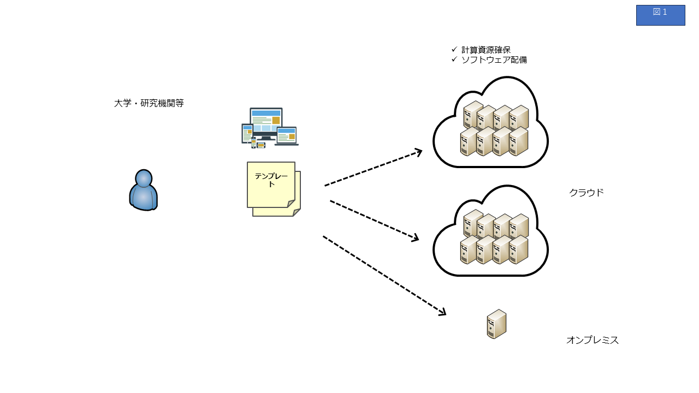

# OCSの構成と仕組み

## OCSの構成の概要

オンデマンド構築サービスのサービス（OCS）の構成と仕組みについて説明します。
OCSは VCコントローラ、 VCP SDK、NII機能拡張版のJupyter Notebookサーバ（Jupyter Notebook） から構成されています。
VCコントローラはSINET通信業者施設に設置され、VCP SDKとJupyter Notebookは利用者環境で稼働します。
利用者がJupyter Notebookよりシステム構築手順や管理手順が記述されたテンプレートを実行します。

次章で、VCコントローラ、 VCP SDK、Jupyter Notebookについて説明します。

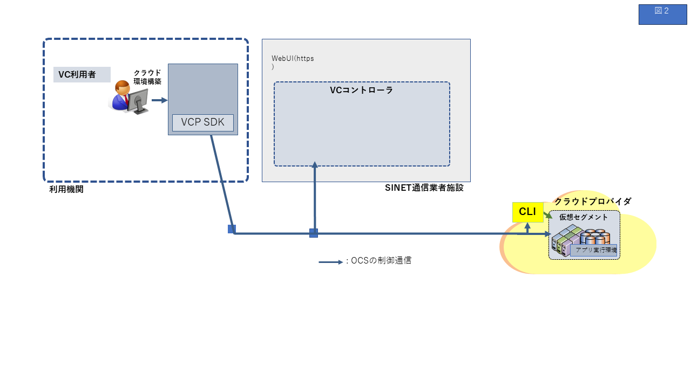

## VCコントローラ

OCSを構成する機能の１つであるVCコントローラについて説明します。
VCコントローラは、各利用グループに専用のものが提供され、下記モジュールで構成されています。

* Virtual Cloud Provider (VCP)：
　　クラウド（IaaS）上の計算・ストレージ資源の構築・削除などの管理をする
* 動作状況の収集・可視化サーバ：
　　確保した計算資源（VCノード、用語参照）の動作状況を収集し、可視化する
* プライベートレジストリ：
　　VCノード（用語参照）で動作するコンテナイメージを保管する
* 秘密情報管理サーバ：
　　シークレットキーなどを管理する
* 仮想ルータ：
　　VCコントローラのルーティングを行う 。
　　仮想ルータにはSINET／仮想ルータ接続で使用するソフトウェアBGPルータも含
　　まれている

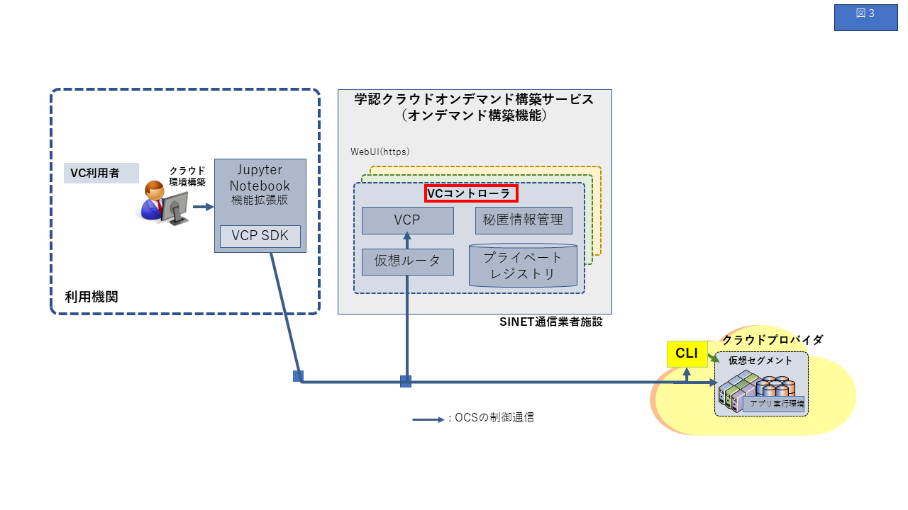

## VCP SDK

OCSを構成する機能の１つであるVCP SDKについて説明します。

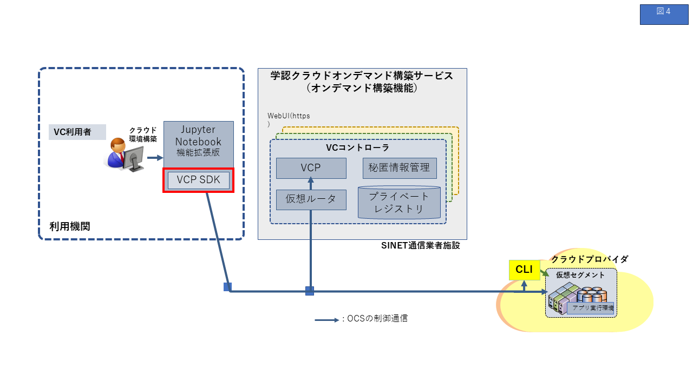

VCPのサービスインターフェースとして、２種類用意しています。

* VCP REST API：
　-YAML形式でクラウド構成情報を構成ファイルに記述
　-詳細な構築・管理が可能

* VCP SDK：
　-Python3 ベースのインタフェースでJupyter Notebookから利用することが可能（図参照）
　-より簡易に構築・管理が可能

VCP では，異なるクラウドプロバイダのAPI の差異を吸収するため、VC コントローラの内部でオープンソースのTerraform （[https://www.terraform.io/](https://www.terraform.io/)）を用いています。VCP REST API では YAML形式で記述された仮想クラウドの構成ファイルを受け取って、その構成ファイルに従ってTerraform 経由で各クラウドへの資源確保等の制御を行います。

この VCP REST APIを呼び出すための Pythonベースの開発キットがVCP SDKです。VCP SDKでは構成ファイルを利用者が自分で書くこともできますが、spec、flavor などの概念で抽象化し、より簡易に構成の記述ができるようにしています。

OCSの公開テンプレートはJupyter Notebook形式で記述されて、VCP SDKを使用しています。
VCP SDKの概念や機能の詳細は、別紙 『VCP SDKマニュアル』（<https://nii-gakunin-cloud.github.io/ocs-docs/VCPSDK-doc/>）を参照ください。

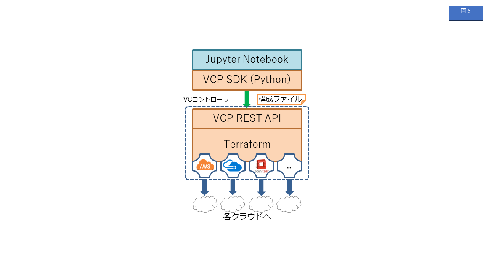

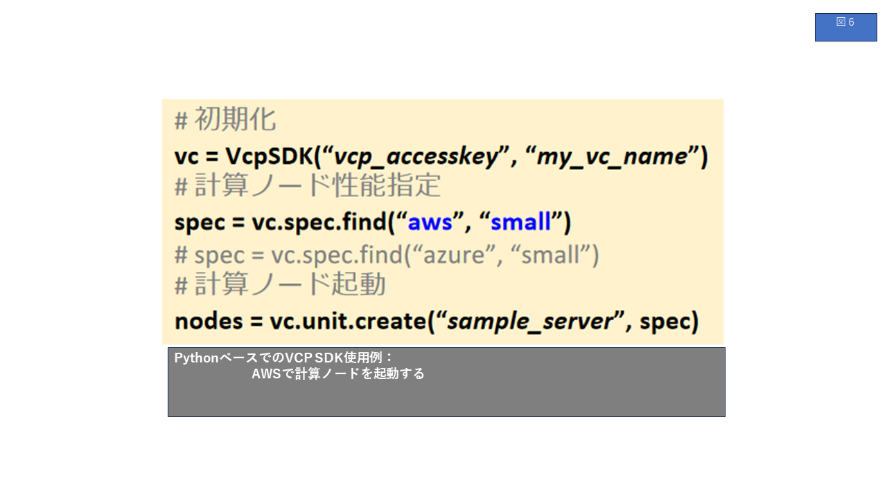

### VCP SDK が扱う構成要素

VCP SDK が扱う構成要素を以下に記します。

* VC (Virtual Cloud)
  * 複数のクラウドにまたがって構築されたひとつの仮想システム環境
* UnitGroup
  * 複数のUnitをまとめて扱うためのものです
  * サーバ、クライアントなどの相互に関係をもつ異質なNode群をグループとしてまとめます
  * `compute` と `storage` の2つのタイプがあります
    * `compute` は仮想マシンなどの計算資源で構成されています
    * `storage` はブロックデバイスなどの記録媒体で構成されています
* Unit
  * 同質（同じ計算資源(cpu, memory, ...)、同じクラウド、同じ用途、...）であるNodeをまとめて扱うためのものです
  * Unitに属するNodeをスケールアウト、スケールインすることができます
* Node
  * UnitGroupを構成する個々のノード
  * UnitGroupのタイプが `compute`の場合
    * [Amazon EC2インスタンス](https://aws.amazon.com/jp/ec2/), [Microsoft Azure VM](https://azure.microsoft.com/ja-jp/services/virtual-machines/) など
    * VCP SDKではこのNodeをVCノードと呼びます
  * UnitGroupのタイプが `storage`の場合
    * [Amazon EBS](https://aws.amazon.com/jp/ebs/), [Microsoft Azure Managed Disks](https://azure.microsoft.com/ja-jp/services/storage/disks/) など
    * VCP SDKではこのNodeをVCディスクと呼びます

VC, UnitGroup, Unit の例を以下の図に示します。

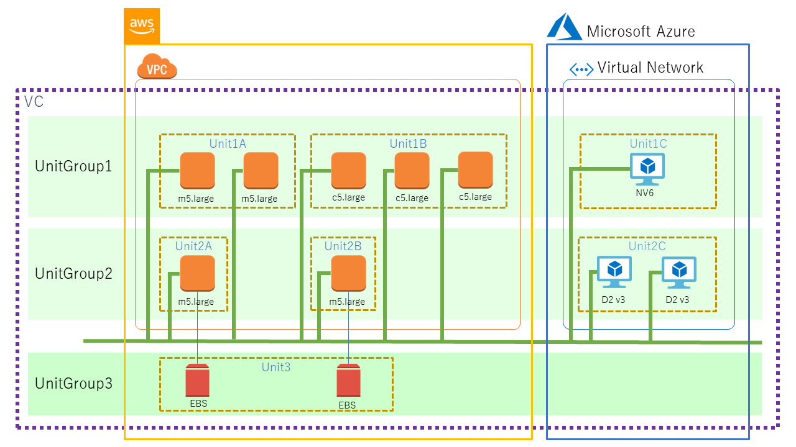

* UnitGroup1: ３つの Unit から構成されている `compute` タイプのUnitGroup
  * Unit1A
    * Amazon EC2 m5.large インスタンスで構成されている Unit
  * Unit1B
    * Amazon EC2 c5.large インスタンスで構成されている Unit
  * Unit1C
    * Microsoft Azure VM NV6 で構成されている Unit
* UnitGroup2: ３つの Unit から構成されている compute タイプのUnitGroup
  * Unit2A
    * Amazon EC2 m5.large で構成されている Unit
  * Unit2B
    * Amazon EC2 m5.large で構成されている Unit
  * Unit2C
    * Microsoft Azure VM D2 v3 で構成されている Unit
* UnitGroup3: １つの Unit から構成されている storage タイプのUnitGroup
  * Unit3
    * Amazon EBS から構成されている Unit

## Jupyter Notebook

オンデマンド構築サービスではJupyter Notebook を使用してワークフローを記述しています。
オンデマンド構築サービスで使用する Jupyter Notebookには、NIIの所内クラウド運用チームが日常の運用・管理業務における利便性向上のために拡張した機能が含まれています。

Jupyter Notebook は、元々、IPythonというPythonの対話的プログラム環境の一部として開発が進めらてきた経緯があります。その流れで現在では主にデータ分析のツールとして使われることも多いようです。分析内容を説明するテキストや図、プログラムまでも一つのファイルドキュメントにまとめることができ、さらに、プログラムが表示されている部分（セルと呼ぶ）を選択し、実行アイコンをクリックするだけで、その場で分析を実行することができます。
この時、プログラムの出力結果も同じ画面に表示され、直ちに確認することができます。

ドキュメント・プログラム・実行結果を１つのファイルで管理できる利点は、クラウド上の資源確保やアプリケーション環境構築のワークフローでも同様に有効です。
オンデマンド構築サービスでは、Jupyter Notebookサーバ を docker イメージとして提供しています。

この Docker イメージには、Jupyter Notebook（NII拡張版）のほか、オンデマンド構築サービスの開発キットであるVCP SDKと、SDKを実行するために必要な環境が用意された状態になっており、利用者は Docker がインストールされた計算資源を用意して、コンテナとして Jupyter Notebook サーバを立ち上げることができるようになります。

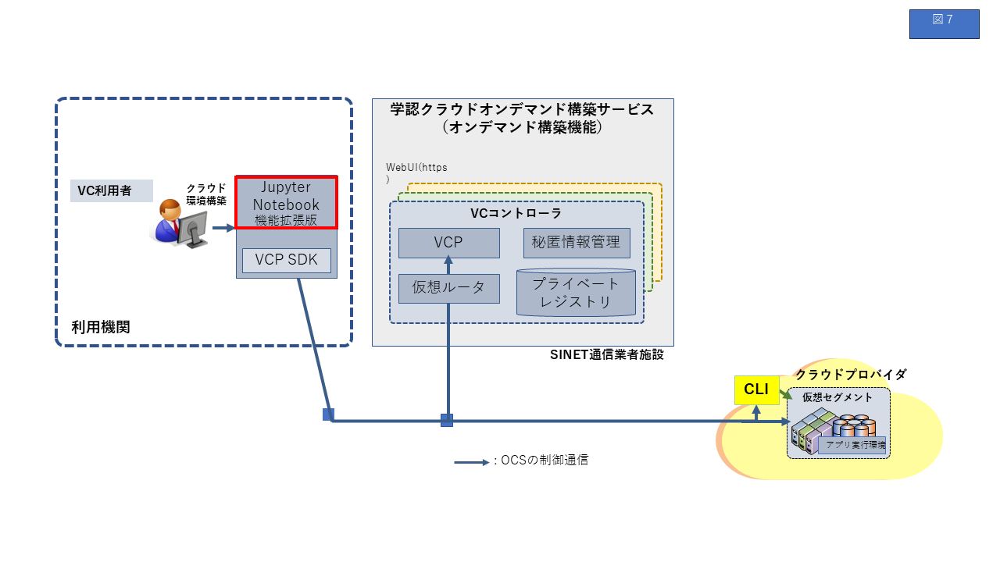

# ユーザ種別とその主要なタスク

OCSではユーザ種別としてVC管理者とVC利用者の2種があり下の表のような役割があります。
それぞれの主要なタスクについて詳しく解説します。

| ユーザ種別                           | 説明                                                                                                                   |
| ---------------------------- | -------------------------------------------------------------------------------------------------------------------- |
| VC管理者                        | VCコントローラの管理者。VCPマネージャを使用して、VCコントローラのアクセストークンの管理、クラウドアクセスのクレデンシャル（アカウント、シークレットキーなど）の管理などを行う。 |
| VC利用者                        | 利用グループのVCコントローラを使用して、クラウド環境を構築する担当者。VC管理者からアクセストークンを入手して作業する。VC管理者は複数のVC利用者にアクセストークンを発行することができる。                  7  |

## VC管理者のタスク

VC管理者のタスクについて解説します。

アクセストークンの発行は VC管理者が行います。詳細は[VCPマネージャ](vcpmgr.md)を参照ください。

### [VCPマネージャ](vcpmgr.md)

VCPマネージャは、VCコントローラの管理者向けの機能をWeb UIで提供します。
VC利用者の追加/権限設定やアクセストークンの発行などについて解説します。

### [秘密情報管理サーバの利用](102_manual.html)

OCSサービスで提供している認証情報等の秘密情報の管理について解説します。

## VC利用者のタスク

VC利用者が使用するJupyter Notebookの操作について解説します。NII拡張についても解説します。
VCP SDKを使用してアプリケーション実行環境を構築するワークフローを記述したJupyter Notebookの例を示します。また、GPUを利用した場合の例を示します。

### [JupyterNotebook入門](JupyterNotebook_Introduction_manual.html)

OCSではNIIクラウド運用チームによるプラグイン拡張されたJupyter Notebook（<https://jupyter.org/>）を使用してワークフロー記述をしています。
JupyterNotebookの基本操作と、NIIクラウド運用チームによるプラグイン拡張の一部について解説します。

### [VCノードの起動、削除](101_manual.html)

OCSを利用してクラウド上にシステム環境を構築し、必要に応じて資源を簡単に追加したり、減らしたりすることができること、複数のクラウドに跨っていることを意識することなく同様に扱えることが理解できます。

### [GPUインスタンスの利用](201_manual.html)

GPUを利用可能なVCノードの作成とアプリケーションコンテナ配備・実行ついて解説します。

## Jupyter NotebookでのVCP SDK利用のための事前準備

この節ではVCP SDKを利用する前に実行すべき事前準備を説明します。
クラウド環境の構築はオンデマンド構築機能のVCコントローラを利用します。VCコントローラの使用にはアクセストークンが必要です。アクセストークンは、サービス利用者として本サービスに登録されたVC管理者が、VCPマネージャを操作して発行します。VC利用者はVC管理者からトークンを入手し、VCコントローラを使用してクラウド環境を構築します。

大まかな操作手順は以下のようになります。

1. VC管理者：VCP マネージャから VC利用者へ提供するアクセストークンを発行する
2. VC管理者：VCP SDKが使用する接続情報などを設定する
3. VC利用者：VCP SDK を用いて起動するVCノードに登録するssh鍵を作成する

### アクセストークン発行

アクセストークンの発行は VC管理者が行います。詳細は[VCPマネージャ](vcpmgr.md)を参照ください。

### VCP SDK が使用する情報の設定

VCP SDK を利用するには  VCコントローラの接続先や、クラウドのクレデンシャル情報などの設定情報が必要です。これらに関する情報はYAML形式の設定ファイルに記載します。クラウドのクレデンシャル情報は以下のどちらかの方法で設定します。

* YAML形式の設定ファイルに直接記述して Jupyter Notebookサーバに置く
* 秘密情報管理サーバに登録する
  ファイルに記述する場合は、VCP SDK ドキュメントの1.7を参照ください。
  秘密情報管理サーバを使用する場合は、[秘密情報管理サーバの利用](102_manual.html)を参照ください。

### ssh鍵ファイルの生成

VCで必要となるSSHの公開鍵認証のための鍵ファイルを作成します。 作成したSSHの鍵ファイルはこのNotebook環境からVCノードにログインする際に利用します。
ノートブック上で鍵を作成する場合は下記のコマンドを実行してください。

```
!mkdir -p ~/.ssh
!test -f ~/.ssh/id_rsa || ssh-keygen -t rsa -f ~/.ssh/id_rsa -N ""
!ls -la ~/.ssh
```

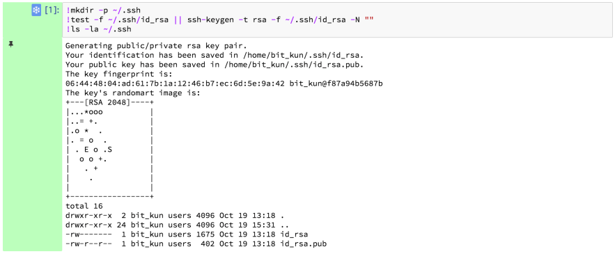

# 情報収集・可視化ツール

オンデマンド構築サービスでは、VCノードの利用状況(CPU負荷、メモリ使用量、ネットワーク）を確認するための情報収集・可視化ツールとして Grafana（<https://grafana.com/>）のダッシュボードを提供しています。

## Grafanaへのログイン

GrafanaのダッシュボードのURLにアクセスすると最初にログイン画面が表示されるので ユーザ名、パスワードを入力してください。

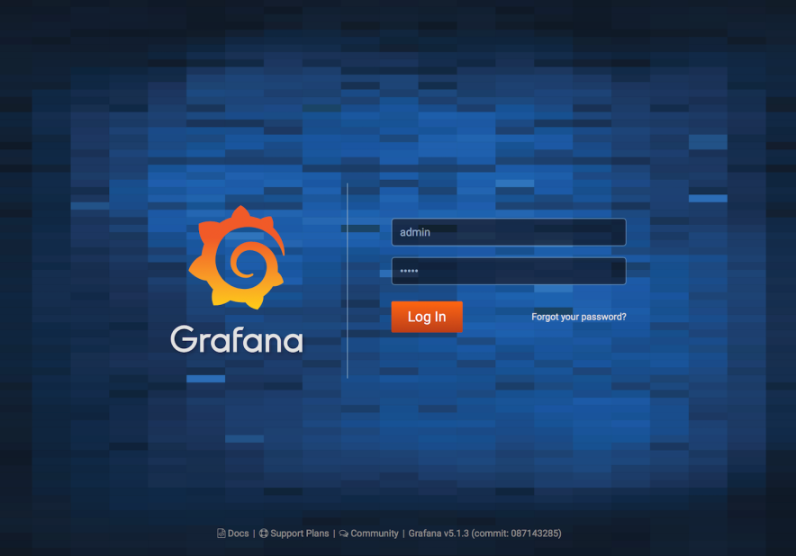

URLは利用グループごとに異なります。初期環境構築時に URL、ユーザ名、初期パスワードをご案内いたします。

### メトリクスのグラフ表示

ログイン後に表示される画面右上の 「HOME」をクリックすると、ダッシュボードの検索画面が表示されます。
「VCP Metrics」というダッシュボードをデフォルトで用意しています。

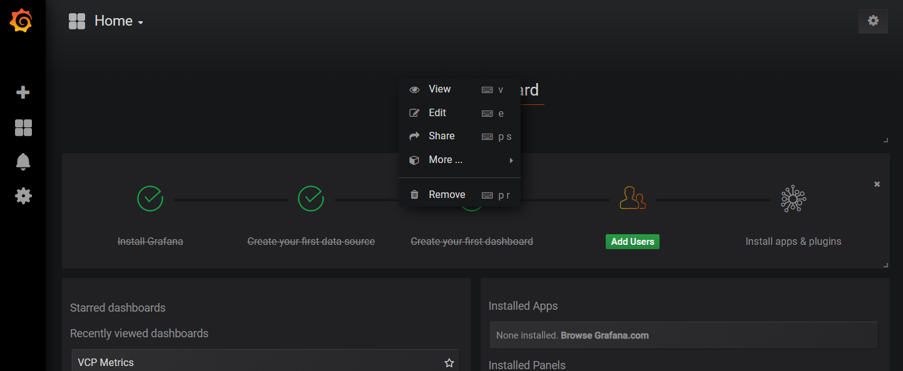
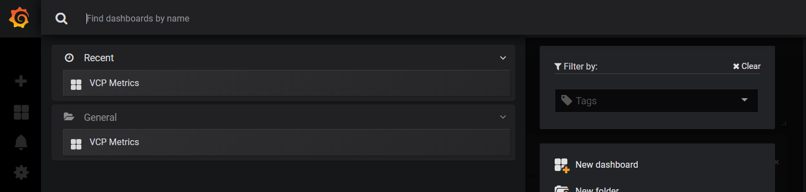

注意： VCP Metrics はオンデマンド構築サービスが標準で提供するダッシュボードです。更新する場合には、別の名前で保存してく ださい。

VCP Metrics は下図のようなダッシュボードです。

左半分のグラフがBaseコンテナ（＝VCノード）の負荷状況、右半分がアプリケーションコンテナの負荷状況のグラフです。
上から CPU使用率、メモリ使用量、ネットワークトラフィック、GPU使用率、GPUメモリ使用量 になっています。GPUについては Base コンテナのみの表示となります。

VCノードやアプリケーションコンテナが複数ある場合には、色の異なる別の系列として表示されます。

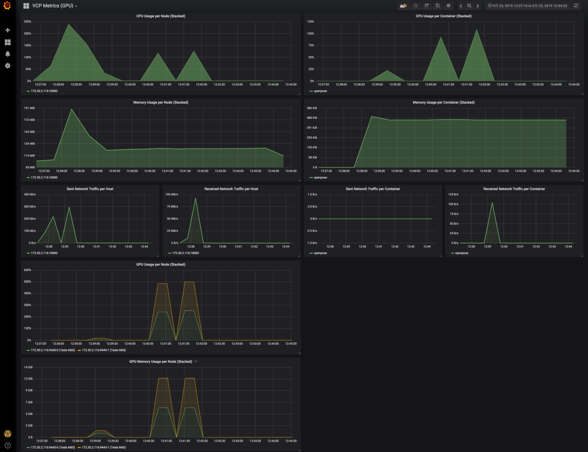

CPU、メモリ、ネットワークについては、VCコントローラのPrometheusとVCノードのcAdvisorを用いてメトリクスを収集します。GPUのメトリクス収集には、VCノード上にPrometheus ExporterのNVIDIA GPU対応ツールである  NVIDIA GPU Prometheus Exporter を利用します。

提供しているダッシュボードでは GPU使用率とGPUのメモリ使用量しか表示していませんが、他にも取得しているメトリクスがあるので、次節を参考に 必要に応じて適宜設定してください。ダッシュボードを更新する際には、別名で保存するようにお願いします。

## GPUメトリクス

NVIDIA GPU Prometheus Exporterにより取得可能なメトリクス情報は以下のとおりです。
提供しているダッシュボードに表示しているのは、nvidia_gpu_duty_cycle と nvidia_gpu_memory_used_bytes になります。

|                                   |                                                                                                               |
| --------------------------------- | ------------------------------------------------------------------------------------------------------------- |
| **メトリクス項目名**                      | **内容**                                                                                                        |
| nvidia_gpu_num_devices            | Number of GPU devices                                                                                         |
| nvidia_gpu_memory_used_bytes      | Memory used by the GPU device in bytes                                                                        |
| nvidia_gpu_memory_total_bytes     | Total memory of the GPU device in bytes                                                                       |
| nvidia_gpu_duty_cycle             | Percent of time over the past sample period during which one or more kernels were executing on the GPU device |
| nvidia_gpu_power_usage_milliwatts | Power usage of the GPU device in milliwatts                                                                   |
| nvidia_gpu_temperature_celsius    | Temperature of the GPU device in celsius                                                                      |

nvidia_gpu_num_devices   を除いて、各メトリクスにはGPUを識別するための以下の情報が付加されます。

* minor_number   複数GPU搭載環境において各GPU単位で   0, 1, 2, ...  のように番号付けられる
* name  GPUの機種名 (e.g. “Tesla M60”)
* uuid   GPUの固有ID

ダッシュボードに設定するには、以下のようにPromQLを記述してください。以下は、GPU使用率の場合の例ですが、他のメトリクス項 目も同様に設定できます。

* Graph &gt; Metrics 設定において、以下の PromQL を記述  
`sum(rate(nvidia_gpu_duty_cycle{instance=\~".+"}[$interval])) by(instance,minor_number, name) \* 100`

* 各GPUを識別するグラフの凡例を表示するために、 Legend format には以下のように記述  
`{{instance}}-{{minor_number}} ({{name}})`

複数GPUを搭載した環境では、各GPUの minor_number 値により GPU Core を識別可能です。
上記の設定で minor_number を添え字にして表示できます。2GPUの場合は 0, 1 が付きます。

# ベースコンテナとアプリケーションコンテナ

この節では VCノード（クラウド上の計算資源）の構成と、コンテナイメージの管理について説明します。

## VCノードの構成

VCノードは下図のような Docker in Docker 構成を取っています。
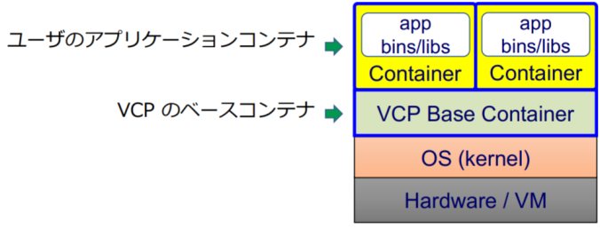

* ベースコンテナ
  * 死活監視やメトリクス収集などシステムの基本機能を提供します。ベースコンテナのDockerイメージは、オンデマンド構築サービスが提供します。
  * ベースコンテナの詳細については、付録『VCP Base コンテナ仕様について』を参照ください。

* アプリケーションコンテナ
  * アプリケーションと関連ソフトウェアをベースコンテナ上に起動します。アプリケーションコンテナの Dockerイメージは、VC利用者が作成します。
  * アプリケーションコンテナの作成方法は、Dockerコンテナの作成方法と同じです。詳 細はDocker の公式ドキュメントを参照してください。
  * アプリケーションコンテナの実行例として[GPUインスタンスの利用](201_manual.html)を参照してください。

## プライベートレジストリ

ベースコンテナ、アプリケーションコンテナなどの  Docker イメージを格納するためのレジストリを、オンデマンド構築サービスが 提供します。レジストリは利用グループごとにVCコントローラ内に設置し、他の利用グループからは参照できません。
レジストリは以下の2種類があります。

* officialレジストリ
  * ベースコンテナのDockerイメージ等を格納するためのレジストリです。VC利用者はpullのみができます。

* userレジストリ
  * アプリケーションコンテナのDockerイメージを格納するなど、VC利用者が任意に使えるレジストリです。VC利用者は、Push 、 Pullのいずれもできます

VCP SDKでは以下のようなコードでレジストリにアクセスできます。

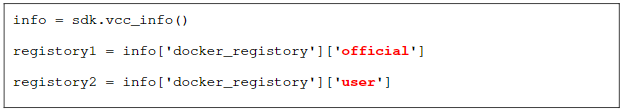

# 関連参考ドキュメント

* [インタークラウド環境構築システムによるアプリケーション環境構築支援のための機能拡張](https://ipsj.ixsq.nii.ac.jp/ej/index.php?active_action=repository_view_main_item_detail&page_id=13&block_id=8&item_id=190635&item_no=1)

# [付録](appendix.md)

* 用語
* VCP JupyterNotebook コンテナ仕様
* VCP Base コンテナ仕様
* VCPにおけるクラウドプロバイダとオプショナル機能の対応
