# VCPマネージャ

VCPマネージャは、VCコントローラの管理者向けの機能をWeb UIで提供します。

## VCPマネージャの主な機能

- VCコントローラのユーザ（VC利用者）追加、権限設定
- VCコントローラのユーザ（VC利用者）のAPI認証トークン発行
- VCコントローラ情報参照
  - VCコントローラの稼働状態、IPアドレス
  - VC管理者の学認ID
  - VCコントローラから利用可能なクラウドの仮想ネットワーク情報
- 秘密情報管理機能サーバに保存されたデータのバックアップ、リストア
- 監査ログのダウンロード

## VCPマネージャへのログイン方法

VC管理者は、学術認証フェデレーション「学認（GakuNin）」を使用してVCPマネージャにログインします。  

- ログインURL: [https://tokyo01.vcloud.nii.ac.jp/vcp/v1/ui/occmgr/menu](https://tokyo01.vcloud.nii.ac.jp/vcp/v1/ui/occmgr/menu)

### 所属機関の選択

学認の所属機関を選択し、所属機関の認証サーバ (IdP: Identity Provider) の手順に従ってログインします。

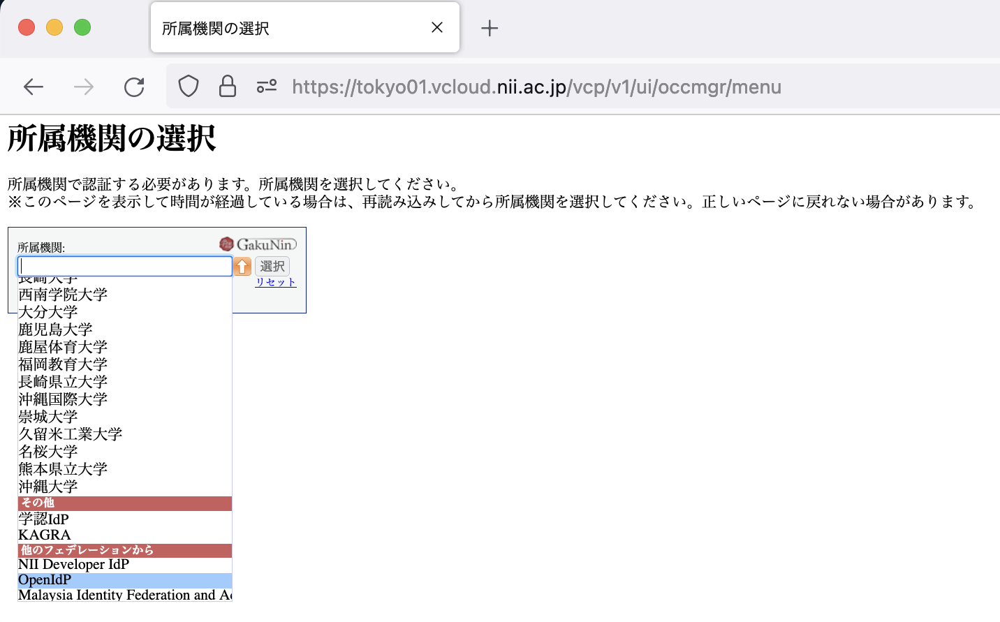

### VCPマネージャ ホーム画面

ログインが成功すると、「VCP-Manager Menu」が表示されます。

- メニュー項目は 「Show VC-Controller List」のみです。

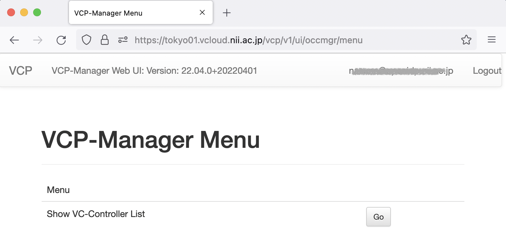

## VCコントローラ 一覧表示と操作メニュー

ホーム画面から「Show VC-Controller List」に進むと、ログインしたVC管理者に割り当てられたVCコントローラの一覧が表示されます。

### 各操作ボタンの機能

- **Detail**
  - VCコントローラ詳細表示（稼働状況、IPアドレス、利用先クラウド）
- **VCC User**
  - VC利用者の追加、権限設定
- **VCC API access token**
  - VC利用者のAPI認証トークン発行
- **Vault**
  - 秘密情報管理機能サーバに保存されたデータのバックアップ、リストア
- **Audit log**
  - 監査ログのダウンロード

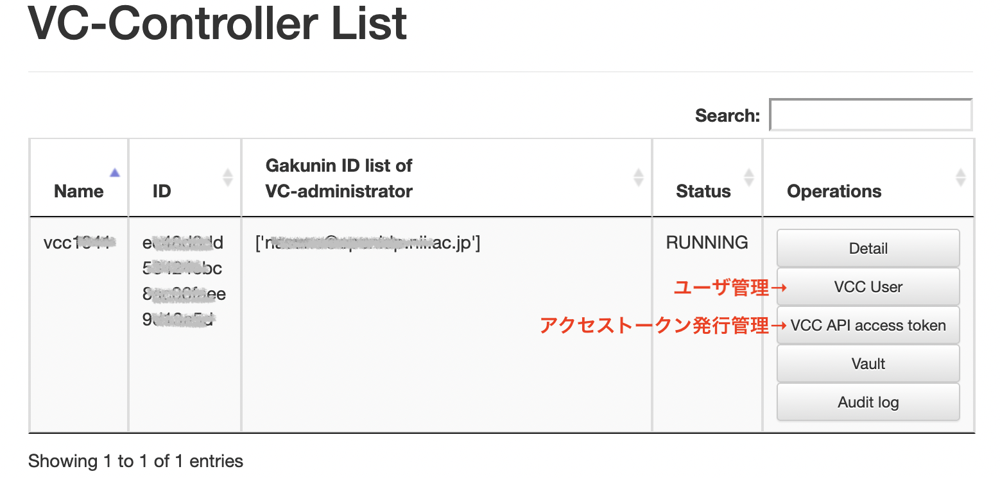

## VC管理者によるユーザ権限設定

ユーザ管理機能は OCS 22.04.0 版において新たに導入された機能です。クラウド資源の操作権限に関するロールを設定することができます。

- 新機能を特に意識せずに 22.04.0 以前のバージョンと同じ仕様で利用したい場合は、後述の  
  「（参考）旧仕様のユーザ・トークン権限で利用するには」を参照ください。

### ユーザ管理機能の目的

任意のVC利用者が作成した資源に対する、保護と上位管理者による管理のご要望に対応するため、ロールによる管理機能を追加しました。管理権限を持つVC利用者のみ、他のVC利用者が作成した資源の参照や削除が可能となります。

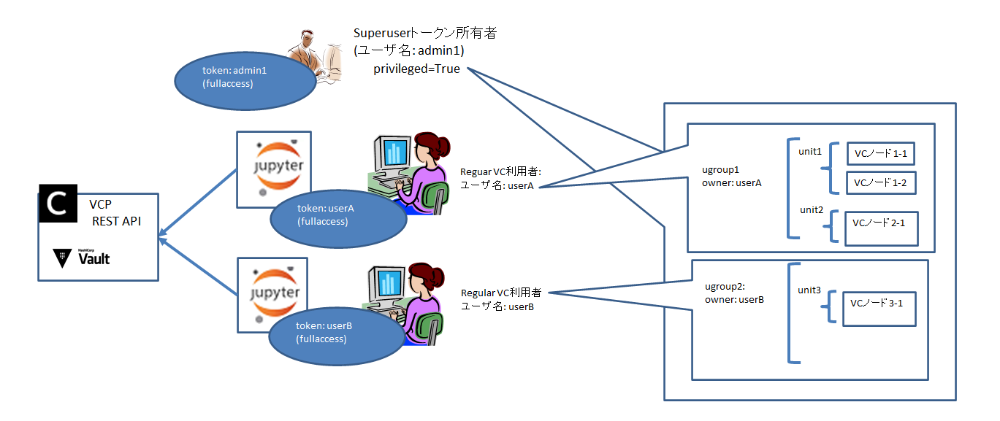

#### ※制約事項

本機能はOCSでのみで有効です。クラウドアカウントでは利用者の区別がないため（VC利用者も上位管理者も同等）、クラウドプロバイダが提供するダッシュボード等を利用すると、OCSのVCPで作成した資源でも他の利用者による参照や削除が可能な点にご注意ください。

### 特権モード機能について

- VCP APIを「特権モード」で利用したときのみ、他ユーザが作成したクラウド資源に対する（情報参照、更新、削除）操作が可能となります。
- 特権モード利用の可否は、アクセストークンの種別で区別されます。
  - Superuserトークン: 特権モード利用**可能**
  - Regularトークン: 特権モード利用**不可**
- ユーザに割り当てるアクセストークンの種別 (`Superuser` / `Regular`) は、管理者のみが設定できます。
- VCPはクラウド資源作成時に使用されたアクセストークンのユーザ名を資源に付与し、その資源の所有者を識別します。

### アクセストークンの種別による可能な操作

- **Superuserトークン所有ユーザ**
  - 特権モードを利用することで、VCコントローラ管理下にある全てのUnitGroupに対してVCP APIを利用可能
  - 特権モードを利用しない場合は、Regularトークンと同等
- **Regularトークン所有ユーザ**
  - 自身で作成したUnitGroupに対してのみVCP APIを利用可能

## ユーザの追加

- ユーザ名とロール (`Superuser` / `Regular`) を指定し、ユーザを作成します。
- 既存ユーザのロールは、「Change user role to ... 」 ボタンにより変更することができます。

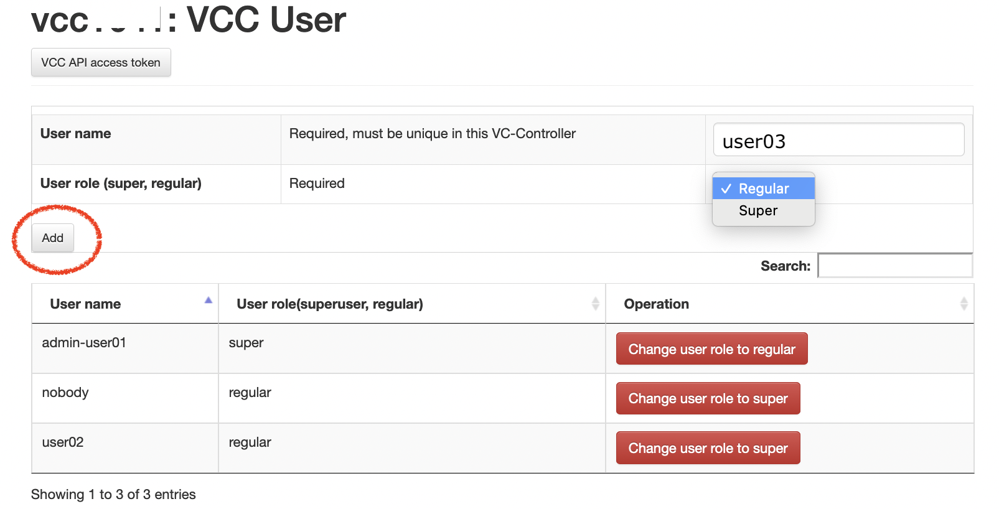

## APIアクセストークンの発行

### トークンとユーザの関連付け

関連付けるユーザを指定した上でアクセストークンを発行します。  

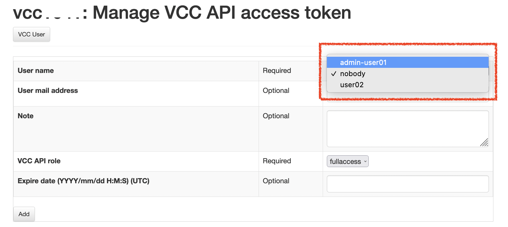

### トークン情報入力

フォームの各項目を入力し、 **Add** ボタンを押します。（末尾の＊印は必須項目）

- User name （トークンを関連付けるユーザ） ＊
- User mail address （ユーザのメールアドレス）
- Note (発行するトークンのメモ書き)
- VCC API role （トークンが利用可能なAPIの制限） ＊
  - 更新処理を伴うAPIの利用を禁止したい場合は **readonly** を選択します。
- Expire date （トークンの利用期限日付）
  - 未入力の場合、10年後がデフォルト値として設定されます。

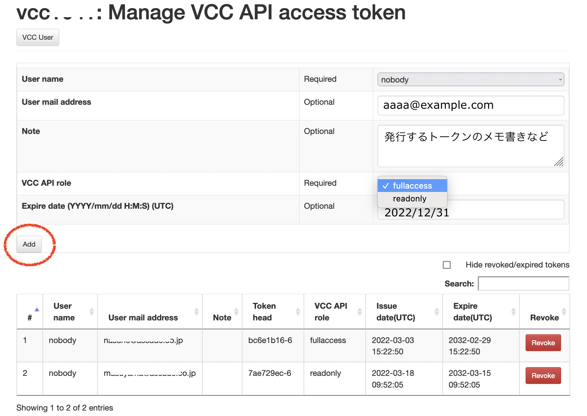

### 発行後の画面表示

 **Add** ボタンを押すと、トークンが発行され、以下のように表示されます。

- **注意事項**
  - 発行されたトークンを表示する機会は作成時の１回限りです。トークンを使用するために、必ず正確に保存してください。

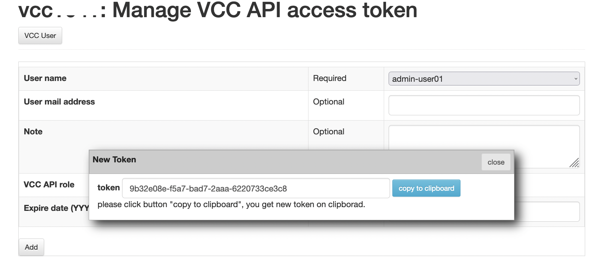

### 発行済トークンの削除

トークン一覧画面において、各トークンの右端にある **Revoke** ボタンを押すとトークンを削除できます。削除されたトークンでは VCP REST API を利用することができません。

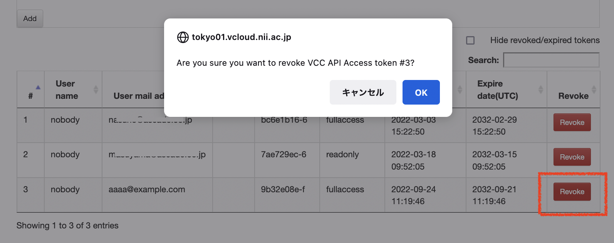

### 発行済トークン一覧

トークン管理画面の下部に、これまでに発行されたトークンの一覧が表示されます。セキュリティを保護するため、トークン文字列の表示は先頭の一部のみとなります。

- 削除済みのトークンはグレーアウトして表示されます。

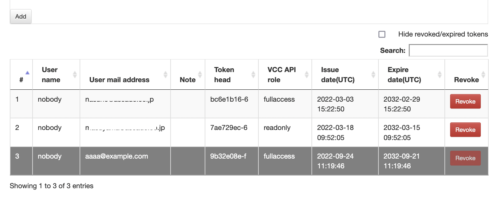

## 旧仕様のユーザ・トークン権限で利用するには

22.04.0 以前のバージョンと同じようにトークンとユーザの関連付けを意識せずに利用するには、新たなアクセストークンを発行する際に、システムデフォルトのユーザ名 `nobody` を関連付けて設定してください。

- `nobody` ユーザは Regular トークン所有ユーザとして事前定義されています。
- `nobody` ユーザに関連付けられたアクセストークンを用いて、同じ `nobody` ユーザで作成されたUnitGroupに対する全てのVCP API操作が可能となります。

## VCコントローラ情報の確認

VCPマネージャのホーム画面の「Show VC-Controller List」において **Detail** ボタンを押すと、 VCコントローラに関する以下の情報を参照することができます。

- VCコントローラの稼働状態、IPアドレス
- VC管理者の学認ID
- VCコントローラから利用可能なクラウドの仮想ネットワーク情報
  - クラウドプロバイダごとに表示項目は異なります。
  - 同一プロバイダで異なるリージョンまたは仮想ネットワークを利用可能な場合は、それらがすべて表示されます。

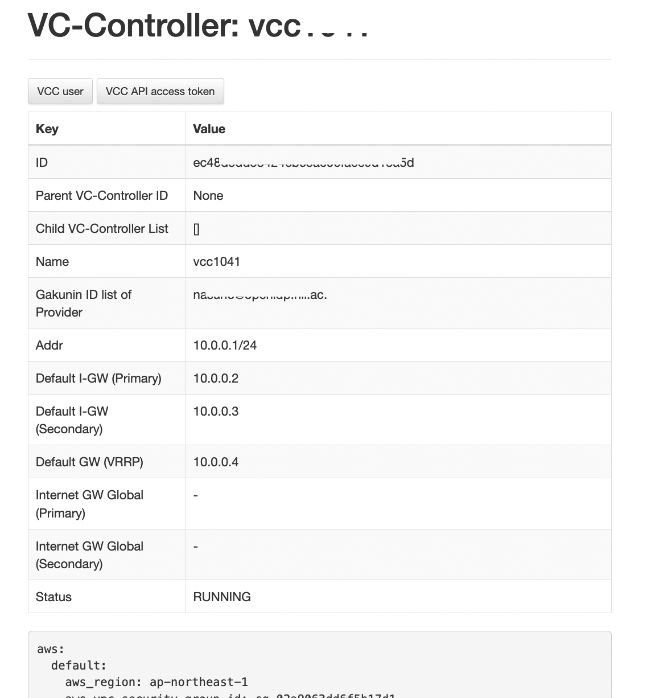

## 秘密情報管理機能サーバのデータのバックアップ、リストア

VC管理者は秘密情報管理サーバ (Vaultサーバ) に保存されているデータを任意のタイミングでバックアップおよびリストアすることができます。

- 「Backup」タブで 「Download vault backup data」ボタンを押すと、アーカイブファイル（tar.gz形式）のダウンロードが開始されます。
  - アーカイブにはVaultのトークン情報と秘密情報が暗号化された状態で格納されています。Vaultのunsealキーを含まないため、VC管理者でもバックアップデータを復号化して内容を読むことはできません。

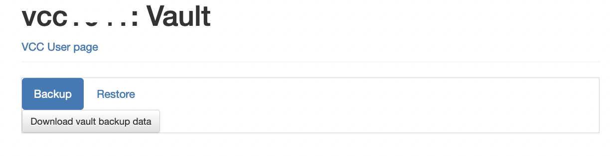

- アーカイブされたファイルを「Restore」タブでアップロードを実行すると、Vaultサーバのトークン情報と秘密情報を上書きすることができます。

## 監査ログのダウンロード

VCPマネージャから以下の監査ログをダウンロードすることができます。

- VCコントローラのログインログ
- VCP REST APIの呼び出しログ
- Terraform実行ログ（Cloud APIの実行ログ）
- Vaultの監査ログ

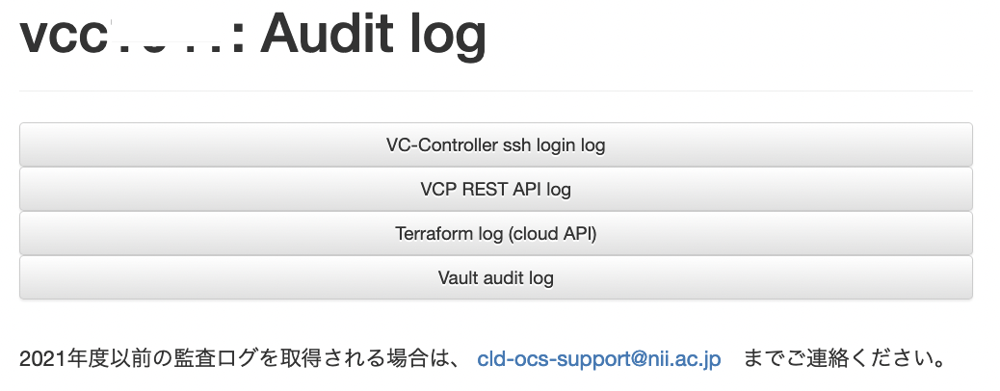
